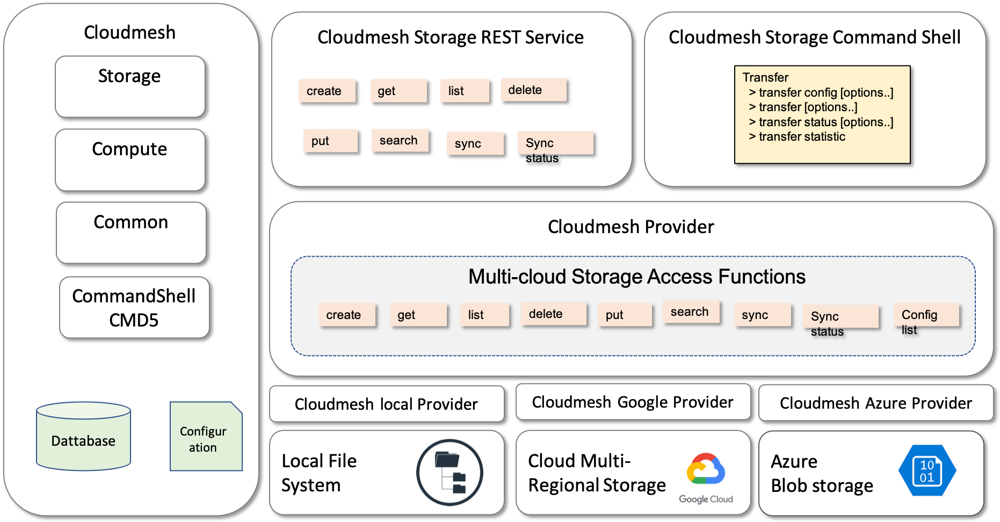
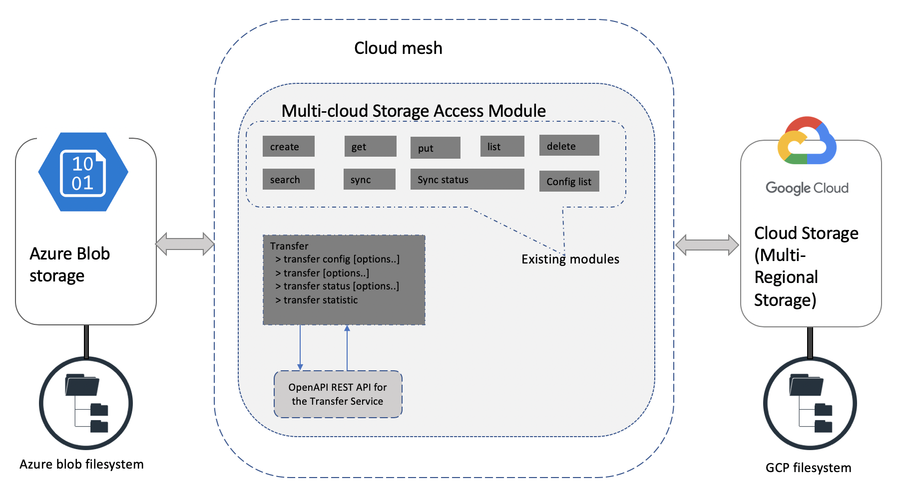

# Cloudmesh Google Storage Provider

* Shreyans Jain, [fa19-516-160](https://github.com/cloudmesh-community/fa19-516-160/blob/master/project/report.md)   
* Gregor von Laszewski


* Code: <https://github.com/cloudmesh/cloudmesh-google/tree/master/cloudmesh/google>
* Command: <https://github.com/cloudmesh/cloudmesh-google/blob/master/cloudmesh/google/command/google.py>
* Provider: <https://github.com/cloudmesh/cloudmesh-google/blob/master/cloudmesh/google/storage/Provider.py> 
* Google Account Manual: <https://github.com/cloudmesh/cloudmesh-manual/blob/master/docs-source/source/accounts/google/account.md>

Open Issues:

* <https://github.com/cloudmesh/cloudmesh-google/issues>
* <https://github.com/cloudmesh/cloudmesh-storage/issues>

## Abstract

Cloudmesh is a multi-cloud platform. With the inclusion of storage
service,  simple to use methods are made
available to Cloudmesh users. The introduction of `cloudmesh-google` package enables users to perform various storage commands for google cloud storage.

We report on activities to integrate local filesystem to Google cloud
storage, and vice versa.
  
 
## Cloudmesh Google Cloud Storage Service  

Cloud users need a way to move files between their computers and cloud
storage. We provide Cloudmesh users an API, and REST service to transfer
files, directories from data storage of one cloud service provider to
other cloud service providers. To work towards this goal, we restricted
the activities to copying files between the local filesystem and the google cloud storage.

The architecture to achieve this are depicted in @fig:160-arch1 AND fig:160-arch2.

{#fig:160-arch1}

{#fig:160-arch2}

This project uses the following technologies.

* Python
* Cloudmesh storage
* OpenAPI 3.0.2
* REST
* Google Cloud Storage

## Cloudmesh Storage Command

As part of this project we have integrated the Google storage capacity
into an existing cloudmesh storage command. The command provides the
following functionality:

```
Usage:
     storage [--storage=SERVICE] create dir DIRECTORY
     storage [--storage=SERVICE] get SOURCE DESTINATION 
     storage [--storage=SERVICE] put SOURCE DESTINATION 
     storage [--storage=SERVICE] list [SOURCE] 
     storage [--storage=SERVICE] delete SOURCE

```

I
## Cloudmesh Transfer Command

In addition, we identified that it is beneficial to have a transfer
command. Our design is included but is not implemented as part of this
project. We realize the command is not as it should be but provides a
valuable starting point for discussion. Especially, the availability of a
prototype for managing Cloudmesh commands in a queue developed by von
Laszewski is an essential step towards implementing such a command.

 
The rough prototype of the command is listed next.

```
  Usage:
        transfer config [--file=ip_file]
        transfer --id=<transfer_id> --data=<file_name> [--copy=True|False]
        transfer status --id=<transfer_id>
        transfer statistic

  Arguments:
      transfer_id   A unique id/name assigned by the user to each transfer 
                    instance
      file_name     Name of the file/directory to be transferred
      ip_file       Input file used to configure 'transfer' command

  Options:
      --id=transfer_id        Specify a unique i/name to the transfer 
                              instance
      --data=file_name        Specify the file/directory name to be 
                              transferred
      --copy=True|False       Specify is the data should be kept in 
                              source location after the transfer 
      --file=ip_file          Specify the file to be used for 
                              configuration
 of the transfer instance 
      -h                      Help function

  Description:
  
    This command is part of CloudMesh's multi-cloud storage service.
    The command allows users to transfer files/directories from the storage of one Cloud Service Provider (CSP) to the storage of other CSP. Current
    implementation is to transfer data between Azure blob storage and
    AWS S3 bucket.


      transfer config [options..]
            Configures source/destination and authentication details 
            to be used by transfer command 

      transfer [options..]
            Transfers file/directory from the storage of one CSP to 
            storage of another CSP 

      transfer status [options..]
            Returns status of given transfer instance

      transfer statistic
            Returns statistics of all transfer processes

  Examples:
      transfer --id="Dummy transfer" --data=dummy_file.txt --copy=True
```


## Benchmarks

We use the following pytest

* <https://github.com/cloudmesh/cloudmesh-google/tree/master/tests>

The Benchmark results can be found at the following link:

* <https://github.com/cloudmesh-community/fa19-516-160/blob/master/project/benchmark.md>

```
+----------------------------+-------+---------------------+--------+
| timer                      | time  | start               | tag    |
+----------------------------+-------+---------------------+--------+
| create source              | 0.001 | 2019-12-20 22:40:57 | google |
| create dir                 | 0.489 | 2019-12-20 22:40:57 | google |
| put                        | 0.355 | 2019-12-20 22:40:57 | google |
| get                        | 0.677 | 2019-12-20 22:40:58 | google |
| list                       | 0.152 | 2019-12-20 22:40:58 | google |
| delete                     | 0.219 | 2019-12-20 22:40:59 | google |
| test_blob_metadata         | 0.076 | 2019-12-20 22:41:00 | google |
| test_rename_blob           | 0.074 | 2019-12-20 22:41:00 | google |
| test_copy_blob_btw_buckets | 0.531 | 2019-12-20 22:41:01 | google |
| test_create_bucket_google  | 0.54  | 2019-12-20 22:41:02 | google |
| test_list_bucket_google    | 0.11  | 2019-12-20 22:41:02 | google |
| benchmark_start_stop       | 0.0   | 2019-12-20 22:41:03 | google |
+----------------------------+-------+---------------------+--------+
```

## Acknowledgements

Dr. von Laszewski contributed significantly to this project while
conducting improvements to code, documentation, and debugging.
 

## References 

* <https://github.com/cloudmesh/cloudmesh-google>
* <https://cloud.google.com/products/storage/>
* <https://myaccount.google.com/>
* <https://support.google.com/accounts/answer/27441>
* <https://cloud.google.com/docs/authentication>
* <https://cloudmesh.github.io/cloudmesh-manual/accounts/google.html>
